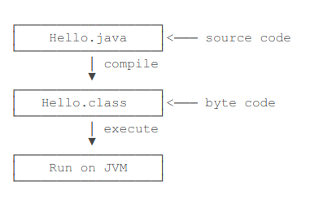
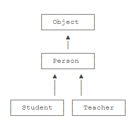
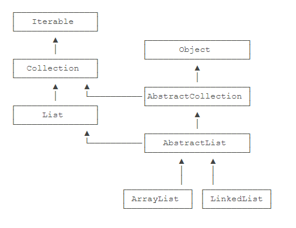
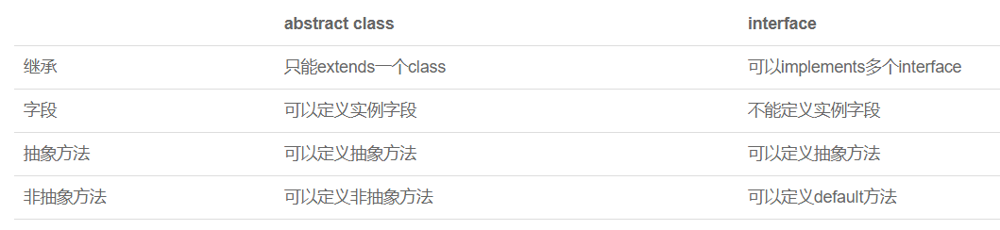
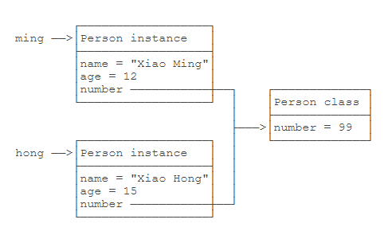
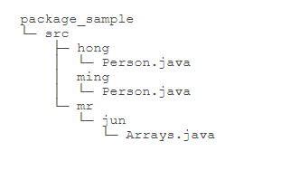
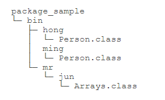
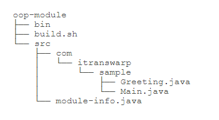
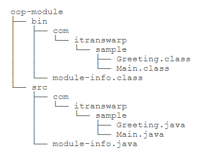

# Java语法总结

Author: [Ari Liang]() Date: [February 19, 2020 23:47:27](#) Category: [Java]()

# Java 基础

## 配置相关

- 一个Java源码只有一个public类型的class，并且class名称与文件名一致，可以包含多个非public类
- Java 11后可以直接`java ClassName.java`运行源代码
- 执行过程



## 语法

### 类型及运算

Java分为基本类型（数值类型）的变量和引用类型的变量，前者存储的是具体的值，后者存的引用

- 基本类型包括：整型，浮点型，布尔型，字符型

*类型小的数在运算过程中会自动转换为大的数，若反过来则要强制转换，丢失精度*

> 整型：byte(1), short(2), int(4), long(8)
>
> 浮点型：float(4), double(8)
>
> 布尔型：boolean(只需要1bit，通常JVM把其表示为4字节整数)
>
> 字符型：char(2)
>
> 常量：final关键字

- 整型：整型的运算结果是确切的

```
// 定义
int i = 2147483647;
int i2 = -2147483648;
int i3 = 2_000_000_000; // 加下划线更容易识别
int i4 = 0xff0000; // 十六进制表示的16711680
int i5 = 0b1000000000; // 二进制表示的512
long l = 9000000000000000000L; // long型的结尾需要加L

// 运算
/**
 *	位运算：
 *	与（&）：如IP的运算
 *  或（|）
 *  非（~）
 *  异或（^）：交换两数
 *
 *	移位运算：<<, >>, >>>（带符号的移位）
 *  
 */
```

- 浮点型：浮点型是不确定的，*故比较两浮点数是否相等，只需判断其差的绝对值是否小于很小的数*

```
float f1 = 3.14f;
float f2 = 3.14e38f; // 科学计数法表示的3.14x10^38
double d = 1.79e308;
double d2 = -1.79e308;
double d3 = 4.9e-324; // 科学计数法表示的4.9x10^-324

// 四舍五入运算：先将其+0.5，再强制转换为整型
```

- 布尔型

> 布尔运算是一种关系运算，关系运算有几个特点：
>
> 短路运算：即能提前确定结果的，就不进行后面的运算
>
> 三元运算：b ? x : y

- 字符型

```
// 表示一个Unicode字符，所以为2Byte
// 用 '' 表示
char a = 'A';
char zh = '中';
```

- 引用类型：String，数组

引用类型存的是引用，*其值是不变的*

```
/** String类型：
 *	可用运算符'+'来连接字符串与数值类型
 *	在java 13中，可用'''.....'''表示多行字符串，以最短空格为基准
 */

String s1 = "hello" + 2 + "world";
String s2 = '''
    		SELECT * FORM USER
    		WHERE username = "TOM"
    		'''

/**
 *	数组：
 *	list.length 计算长度
 *	一旦创建，长度不可变
 */
int[] list1 = new int[5];
int[] list2 = new int[] {3, 4};
int[] list3 = {1, 3};
```

- 其他

var关键字：若引用类型名字太长，可用var表示，编译器自动判断

```
StringBuilder sb = new StringBuilder();
var sb = new StringBuilder();
```

### 输入输出

- 输出

```
// 不带换行
System.out.print("TEXT");

// 输出带换行
System.out.println("Text");	// 换行输出
System.out.println();		// 换行效果

/** 格式化输出：
 *  	%d：整型
 *		%o：八进制
 *		%x：十六进制输出
 *		%f：浮点
 *		%e:科学计数法
 *		%s：字符串
 *		%%：输出%
 *  更详细的格式化：
 * 		%08x，表示高位补0输出8位宽度十六进制
 *		%.4f，表示保留四位小数
 */
System.out.printf("%d, %08x", value1, value2);
```

- 输入

```
// 需要导入包
import java.util.Scanner;

// 建立输入对象，不建立只用System.in也可以，但复杂
Scanner scanner = new Scanner(System.in);

String name = scanner.nextLine();	// 读入一行字符串
int age = scanner.nextInt();		// 读入数字
```

### 条件判断

- if条件判断

> 写条件时注意：
>
> 注意条件顺序
>
> 注意边界条件
>
> 建议一条语句时都加花括号

- 判断时`==` 的用法：

> 1. 若是基本类型的变量，则是比较值是否相等
>
> 注意：浮点数不能直接`==`判断，而需要计算其差的绝对值，小于很小的数
> 若是引用类型的变量，则是判断引用是否一样
>
> 1. 引用类型变量利用`ins.equals()`判断逻辑上是否相等
>
> 注意：引用变量的值可能是null，使用`v.equals()`会报错，那么可以这样判断：`if (v && v.equals(y))`
>
> 还可以把一定不是null的对象放前面 `if ("hello".equals(hello))`

- switch用法

```
// 基本用法是 switch (表达式的结果)，可以是匹配字符串

switch (option) {
    case 1:
        // statement
        break;
    case "hello":
        // statement
        break;
    default:
        break;
}

// Java 12的新用法，类似于模式匹配（Pattern Matching）,保证只有一条路径会执行
// 注意：此用法为预览特性，编译时指定 javac --source 13 --enable-preview Main.java
// 不需要写break
switch (fruit) {
    case "apple" -> System.out.println("Apple");
    case "pear", "mango" -> {
        // Some statements
    }
    default -> {
        // Some statements
    }
}

// 新特性中switch可以返回值，利用yield
int opt = switch (fruit) {
    case "apple" -> 1;
    case "pear", "mango" -> 2;
    default -> {
        // Some statements
        yield 3;
    }
}
```

### 循环

- `while`与`do...while`的区别

> 前者先判断再执行循环，后者先执行再判断是否循环

- `for`循环：基于*索引的循环，经常用于处理数组*

> 1. 先初始化计数器，计数器最好仅在循环内使用
> 2. 循环体内最好不要修改计数器，会造成逻辑混乱
> 3. 奇数循环`for (int i = 1;i < n;i += 2)`
> 4. 偶数循环`for (int i = 0;i < n;i += 2)`

- `for...each`循环：基于*内容的循环，只是顺序取出每个值*

> 1. 格式`for (int each : all)`

## 面向对象

### 基本概念

> 1. 基本：类class，实例instance，方法method
> 2. 面向对象实现方式：继承，多态，封装
> 3. 访问控制方式：package，classpath，jar
> 4. 核心类库：字符串，包装类型，JavaBean，枚举，常用工具类

### 类，对象，实例

```
// 类其实就是定义的数据类型，只是一个模板
public class Person {
    // fields/attributes
    private String name;
    private int age;
    
    // constructor, with no return type
    public Person(String name, int age) {
        this.name = name;
        this.age = age;
    }
    
    // methods
    public void setName(String name) {
        this.name = name;
    }
    public String getName() {
        return name;
    }
    // ...
}

// 对象就是类的的一个个体，对象。
// 注意：指向实例的变量都是引用变量
Person tom;

// 实列化一个类，用对象指向这个实例，利用关键字new。
// 则tom就是Person的一个实例，它是一个对象
// 注意：每个对象实例的field都不相同，相互独立
tom = new Person("Tom", 12);

// 一步到位
Person bob = new Person("Bob", 13);
```

### 方法

**基本特点**

1. 通过private隐藏内部字段，通过getter()和setter()来暴露接口，*这样可以在设置字段的时候先判断/处理一下，以保证字段的逻辑正确*
2. 外部代码可操作public约束的方法，类的内部可以调用private约束的方法
3. 在方法内部可使用隐藏变量this，它始终指向当前实例，通过this.field就可访问当前实例的字段。若方法中参数名与字段名一致，局部变量优先级更高，就要使用this来访问字段
4. 只要返回值，方法名，参数长度，参数类型不同，即是不同的方法
5. 可变参数：可用`类型...`定义，可变参数相当于数组类型，完全可以把可变参数改写为数组，但调用方法的时候需要传入实例

```
private String[] names;

// 可变参数
public void setNames(String... names) {
    this.names = names;
}

// 可变参方法的调用，直接传入同类型参数列表
// 注意：可以传入0个或多个参数，可以保证不传入null，因为不传入参数就相当于传入了一个空数组
p.setNames("Tom", "Bob", "Alice");


// 改写为数组参数
public void setNames(String[] names) {
    this.names = names;
}

// 调用数组参数方法，需传入一个实例对象
// 注意：此时可能传入的时null
p.setNames(new String[] {"Tom", "Bob", "Alice"});
```

1. 参数的绑定

> 1. 基本类型的参数，传入方法时是*复制*，在外部变量更改时，不影响对象里的字段
> 2. 引用类型的参数，传入的是*引用*，若外部的引用变量内容改变，则对象的引用字段的内容也相应改变

1. 方法的重载

方法名相同，参数不同，叫做方法重载

```
// 方法重载的返回值的都是相同的，比如String提供的多个重载方法indexOf()
int indexOf(int ch);					// 根据字符的Unicode码查找；
int indexOf(String str);				// 根据字符串查找；
int indexOf(int ch, int fromIndex);		// 根据字符查找，但指定起始位置；
int indexOf(String str, int fromIndex);	// 根据字符串查找，但指定起始位置。
```

**构造方法**

*没有构造方法时，编译器会自动创建一个构造方法*

```
// 构造方法没有返回值，名字就是类名
public Person(String name, int age) {
    // TODO
}

// 没有在构造方法初始化参数时，引用类型默认是null，int类型是0，boolean为false
// 也可以直接对字段初始化
clas Person {
    private String name = "Tom";
    private int age = 12;
}

// 构造方法可以重载，编译器根据参数的不同自动选择构造方法
public Person(String name, int age){
    // TODO
}
public Person(String name, int age, String sex){
    // TODO
}

// 构造方法调用必须创建实例，用关键字new
new Person("Tom", 12);
```

### 继承

1. 利用继承可以复用代码，从一个类派生出另一个子类，只需在子类中增加方法即可。利用关键字`extends`实现
2. OOP中把父类(parent class)也称作超类(super class)，基类(base class)；子类(subclass)也称作扩展类(extended class)
3. Java中只允许继承自一个类，一个类有且仅有一个父类，而`Object`没有父类，一切类都派生于`Object`
   
4. 继承过程中，子类无法访问父类的`private`字段和方法，换成`protected`关键字修饰，可以将访问控制在继承树内
5. `super`表示超类，子类引用父类字段时，可以用`super.field`

```
//// 这里用super.name, name, this.name的效果都是一样的，定位到父类的字段
class Student extends Person {
	public String getName() {
        return super.name;
        // return name;
        // return this.name;
    }
}

//// 某些场合必须用super
class Person {
    protected String name;
    protected int age;

    public Person(String name, int age) {
        this.name = name;
        this.age = age;
    }
}

class Student extends Person {
    // 子类增加了一个字段
    protected int score;

    public Student(String name, int age, int score) {
        // 在子类构造方法执行前，会先自动执行父类的构造方法，不然会报错
        // 子类不能继承父类的构造方法
        super(name, age);
        this.score = score;
    }
}

Student tom = new Student("Tom", 12, 84);
```

1. `is`关系的可以用继承，比如`Student` is `Person`；而`has`关系的不能用继承，如`Student` has `Book`
2. **转型**

```
//// 可以安全的向上转型(Upcasting)
// 因为Student继承自Person，拥有其全部功能，Person类型变量去操作Student对象是没有问题的
// 这种转型实际上是把子类安全的抽象为父类
Person p = new Student();

// 继承树是Student -> Person -> Object，也可以用Object变量指向Student或Person
Student s = new Student();
Person p = s;
Object o1 = s;
Object o2 = p;

//// 向下转型需判断是否安全(Downcasting)，向下转型需指定转换的类型
Person p1 = new Student();
Person p2 = new Person();
Student s1 = (Student) p1;	// 正确，s1指向原类实例
Student s2 = (Student) p2;	// 错误，s2指向父类实例；因为子类的功能比父类功能多，将父类转型为子类，在操作某个方法时会不存在，多的功能不能凭变出来

// 所以向下转型的时候需要判断
Person p1 = new Student();
Person p2 = new Person();

// true
if (p1 instanceof Student) {
    Student s1 = (Student) p1;
}

// false
if (p2 instanceof Student) {
    Student s2 = (Student) p2;
}
```

### 多态

1. 继承过程中，子类定义了与父类完全相同的方法，叫做覆写(Override)，在覆写的时候可以加上参数(@Override)来让编译器检查是否正确覆写
2. 考虑这种情况

```
// 若子类覆写了父类的方法，那么在父类引用变量指向的实例；在调用方法的时候，调用的是子类的方法，还是父类的方法是不确定的，而要到运行的时候才能确定，这种不确定性称为多态(Polymorphic)！
Person p1 = new Student();
p1.method();	// Person.method() or Student.method()?

Person p2 = new Person();
p2.method();	// Person.method() or Student.method()?

// 或者这种情况
// 此时传入的变量p指向的是Person还是Student的实例，是不清楚的
public void methodTwo(Person p) {
    p.method();	// Person.method() or Student.method()?
}
```

1. 多态的特性能够*让更多类型的子类去扩展功能，而不需要修改父类的代码*，我可以不关心子类是如何实现的，只管用就行了
2. 子类中调用父类的方法利用参数`super`，如`super.getName();`
3. 类加上`final`则不能被继承，方法加上`final`则不能被覆写，字段加上`final`则在初始化后不能修改

### 抽象类

```
// 若类中的方法仅仅是定义方法，具体的实现是靠子类去覆写，那么这个方法就是抽象方法
// 利用关键字abstract
class Person {
    // 可以定义字段
    protected abstract boolean humanBeing = true;
    
    public abstract void run();
    public void eat();			// 可以定义非抽象方法
}

// 定义了抽象方法，方法中没有任何动作，那么这个类不能被实例化，不能被编译；
// 应该把类也定义为抽象类，才能编译通过
// 因为抽象类只定义了方法而没有实现，靠子类覆写，这就相当于定义了一个规范；子类在继承的时候必须重写方法
abstract class Person {
    public abstract void run();
}

// 面向抽象编程，好处在于，调用Person.run()的时候，不用关心run()具体怎么实现的；不用关心子类的类型
// 尽量引用更抽象的类型，避免引用实际子类的类型，成为面向抽象编程
Person p1 = new Student();
Person p2 = new Teacher();

p1.run();
p2.run();

// 同样的代码，仍不用担心其具体类型
Person p3 = new Employee();
p3.run();
```

### 接口

**基本概念和用法**

```
// 若一个抽象类中没有字段，并且方法全都是抽象方法，这是可以申明为接口
// 接口没有字段，所有方法都是默认的public abstract方法
// 接口比抽象类更抽象
abstract class Person {
    public abstract void run();
    public abstract void eat();
}

interface Person {
    void run();
    void eat();
}

// 具体的类去实现接口时，使用关键字implements
// 继承(extends)时只可继承自一个类，而一个类可以实现(implements)多个接口
class Student implements Person, Hello {
    public void run() {
        // TODO
    }
    
    public void hello() {
        // TODO
    }
}

// 接口可以继承自另一接口extends，相当于扩展了接口
interface Hello {
    void hello();
}

interface Person extends Hello {
    void run();
    void eat();
}
```

**实际特性**

1. 合理设计`interface`和`abstract class`可以充分复用代码；一般来说，公共逻辑应该放到`abstract class`中，具体逻辑放到各个子类中；而`interface`代表更抽象的层次
2. Java集合类定义的接口，抽象类，及具体子类的关系



```
// 在使用的时候，实例化的永远是某个具体子类，但总是通过接口去调用它，因为接口比抽象类更抽象
List list = new ArrayList();	// 利用List接口引用具体的子类实例
Collection coll = list;			// 向上转型为Collection接口
Iterable it = coll;			// 向上转型为Iterable接口
```

1. `default`(jdk 8)方法：在接口中新增方法时，若没有`default`修饰，则全部实现类中必须重新实现这个方法；有了`default`，接口中这个方法可以允许被实现，而不用修改实现子类。但`default`也无法访问字段

### 抽象类和接口的比较



### 静态字段和静态方法

**静态字段**

1. class中定义的字段称为实例字段，特点是每个实例中的字段都是独立的，互不影响
2. `static`修饰的字段*在每个实例中都是共用的，存储在一个共享的空间，并不属于实例*。修改这个实例，会影响其它实例
3. 虽然用实例可以访问静态字段，*但其实都是通过转换为class的字段去访问的*，所以更推荐直接用class去访问，而不是实例



```
// 直接通过class访问静态字段（类字段）
Person.number = 99;
```

**静态方法**

1. 也是直接通过类去调用静态方法，而不是用实例变量去调用
2. 因为静态方法属于类，故静态方法内部无法访问`this`变量，也无法访问实例字段
3. 通过实例变量访问静态字段和静态方法，会得到警告
4. 静态方法常用于*工具类，也用于辅助方法*，main()方法也是静态方法

```
Arrays.sort();
Math.random();
```

1. 因为`interface`是纯抽象类，无法定义实例字段，但可以有静态字段

```
// public static final修饰
public interface Person {
    public static final int MALE = 1;
    public static final int FEMAIL = 2;
}

// 实际上interface字段只能是public static final类型，所以可以去掉
public interface Person {
    // 编译器自动加上 public static final
    int MALE = 1;
    int FEMAIL = 2;
}
```

### 包

包的结构，`src`是源码目录，`bin`是生成的字节码目录：





1. 为了解决类名相同，而引起冲突，Java提供了包(package)的机制

```
// 其实类名只是简写，完整的类名要加上包
// 包的命名规则：
// 1. 包的命名推荐用倒序的域名来确保唯一性
// 2. 注意不要和java.lang包的类重名，如String, System, Runtime
// 3. 也不要和jdk的类名重合，如java.util.List, java.text.Format, java.math.BigInteger
org.apache;
org.apache.commons.log;
java.util;
com.ariliang.sample;

// 包的声明，若没有声明包，则是默认的包，不推荐
// 注意：包没有父子关系，比如java.util与java.util.zip是不同的包，没有任何继承关系
package com.ariliang;

public class Arrays {
    // TODO
}

// 编译命令，编译后的字节码目录结构要与包（源码）的结构一致
javac -d ../bin ming/Person.java hong/Person.java mr/jun/Arrays.java
```

1. 若未指定访问作用域，同一个包的类可以相互访问

```
// 未指定public或private等，同一个包的类可以相互访问
package com.ariliang.hello;
class Hello {
    // TODO
}

package com.ariliang.hello;
class Person {
    Hello hello;
}
```

1. 访问其他包，`import`导入其他包

```
// 直接利用类全称来使用
java.util.Arrays arrays = new java.util.Arrays();
java.util.Arrays.sort();
System.out.println();

// import导入包
package hello;
import java.util.Arrays;

// import导入多个类，因很难知道导入的类属于哪个包，不推荐
import hello.*;

// 还可以导入一个类里的静态字段和静态方法，很少使用
import static java.lang.System.*;
out.println();
```

1. 类的查找顺序：因为Java最终编译出的`.class`文件是完整类名，要找到某个类的位置

```
// 若类为完整类名则直接查找这个类

// 若是简单类名：
// 1. 查找当前package是否存在这个类
// 2. 查找import的包是否存在这个类
// 3. 查找java.lang包是否存在这个类，这个包会自动导入，但类似于java.lang.reflect这种包还是需要手动导入
```

### 作用域

1. 若被`public`修饰的类，可以被其他不同包的类访问；在`public class`的前提下，`public`修饰的字段、方法可被其他不同包的类访问
2. 被`private`修饰的字段、方法，访问被限制在类的内部，可由类的内部的其他方法访问；为了可读性，`private`修饰的方法通常放在所有`public`方法之后，与方法声明的顺序无关，即：前面声明的方法可以调用后声明的方法
3. Java支持嵌套类(nested class)，即类的内部还可以声明类，这个类可以访问外部类的`private`字段或方法
4. `protected`用于继承，被其修饰的字段和方法可被子类继承，及子类的子类
5. 包的作用域：同一个包内（包名完全一致，org.apache与org.apcahe.abc是完全不同的包），一个类可以访问没有被`private`, `public`修饰的类，以及没有被`public`, `protected`, `private`修饰的字段和方法
6. `final`

> 1. 被final修饰的类无法被继承
> 2. 被final修饰的方法无法被子类覆写(Override)
> 3. 被final修饰的字段初始化后无法被重新赋值
> 4. 被final修饰的局部变量可以阻止被重新赋值

1. 最佳实践

> 1. 无法确定是否需要public，就不声明为public，应尽量减少字段和方法的暴露
> 2. 把方法定义为package权限有助于测试，只要位于同一package，测试代码就可访问被测试类的

### classpath

1. 源文件`.java`被编译为JVM可以执行的字节码`.class`，JVM在运行阶段需要正确加载`.class`就需要知道从哪加载，`classpath`就定义了这个加载路径，其实就是环境变量

> 这个classpath环境变量有两种设置方式：
>
> 1. 在系统的环境变量中设置
>
> 2. 运行时给定classpath参数（推荐）
>
>    win下分号隔开：`java -classpath(-cp) .;dir/workspace/bin;dirs... com.ariliang.Hello`
>
> 注意：
>
> 1. IDE中运行的Java程序，自动传入-cp参数是*当前工程的bin目录\*和*引入的jar包*
> 2. ⚠不用把JVM核心库`rt.jar`导入-classpath中，它会自动找到
> 3. 更好的做法是，不用设置classpath，大多时候默认的`.`目录就够了

1. `jar`包：若有很多`.class`散落在各个目录中，不便于管理，将其打包变成一个文件，就方便多了

> 1. 实际上就是一个zip格式的压缩包，而jar相当于目录；要执行一个jar包的`class`，就把它放入-classpath就行了
>    `java -cp ./hello.jar abc.xyz.Hello`
>
> 2. 创建jar包：直接把编译的bin目录下所有目录和文件打包为zip，再改后缀为jar就行了
>
> 3. jar包内还可以包含特殊的`/META-INF/MANIFEST.MF`纯文本文件，它可以指定`Main-class`和其他信息；JVM会自动读取这个文件，若存在`Main-class`，就不必再指定启动的类名而直接运行
>
>    `java -jar hello.jar`
>
> 4. jar包还可以包含其他jar包，就需要在`MANIFEST.MF`中配置classpath
>
> 5. 大型工程中不可能手动编写`MANIFEST.MF`，可以利用其他的开源构建工具如Maven，可以很方便的创建jar包

### 模块

**Java 9开始引入了模块**

1. Java 9之前大型的Java程序会生成自己的jar，还有其他的第三方jar，JVM自带的Java标准库也以jar方式存放叫做`rt.jar`，jar就是存放JVM可执行的字节码问价`.class`的容器

2. 若是自己开发的程序要执行，就会是这种样子

   `jar -cp app.jar:a.jar:b.jar:c.jar com.ariliang.sample.Main`

   若漏写运行时用到的jar，程序就会抛出`ClassNotFoundException`，所以jar只是存放的容器，*不包含任何class间的依赖信息*

3. 模块的引入，主要是解决依赖的问题，自带依赖关系的容器叫做模块；Java 9后偌大的`rt.jar`被拆分为若干个模块，模块名就是文件名

   > 在`$JAVA_HOME/jmod`目录
   >
   > java.base.jmod 对应java.base模块，以此类推
   >
   > java.compiler.jmod
   >
   > java.datatransfer.jmod
   >
   > java.desktop.jmod

4. 模块之间的依赖关系被写入到`module-info.class`文件中；若有的文件都直接或间接的依赖`java.base`模块，只有它不依赖任何模块，可以看作根模块

5. 模块不仅要对`class`打包，*还要写入依赖*，还可以包含二进制代码(通常JNI扩展)；*模块支持多版本*，即在模块中为不同的JVM提供不同的版本

**创建模块**

结构：



1. `module-info.java`编写方法，*模块名与报名的命名方法一致*

```
// 模块的声明方法
module hello.world {
    // 需要引用的模块
    requires java.base;	//可不写，会自动引入java.base
    requires java.xml;

    // 指明导出的包，这样其它模块才能访问
    exports com.ariliangs
    exports com.ariliang.sample;
}

// 必须要写了引用的模块，才能使用其中的类
// 若从module-info.java中没有requires java.xml，编译会报错
import java.xml.XMLConstants;
```

1. 创建模块：

   > 1. 在工程目录下：`module-info.java`被编译为`module-info.class`
   >
   >    `javac -d bin src/module-info.java src/com/ariliang/sample/*.java`
   >
   > 
   >
   > 1. 下一步，将bin目录下的所有class打包为jar；打包的时候注意传入`--main-class`参数，让jar包能自己定位main方法所在的类，这样就得到了一个`hello.jar`包；它和普通的jar包没有区别，可以用`jar -jar hello.jar`来执行
   >
   >    `jar --create --file hello.jar --main-class com.ariliang.sample.Main -C bin .`
   >
   > 2. 将jar包转换为模块，这样就得到了模块`hello.jmod`
   >
   >    `jmod create --class-path hello.jar hello.jmod`
   >
   > 3. 运行模块，只需指定模块名
   >
   >    `java –module-path hello.jar –module hello.world

2. 打包jre：以前要运行jar包需要完整的jre运行环境，非常庞大；有了模块之后，jre被拆分为多个模块，就可以依据需要的功能，量体裁衣

   > `jlink --module-path hello.jmod --add-modules java.base,java.xml,hello.world --output jre/`
   >
   > `module-path`指定了要生成的模块；`add-modules`指定需要的模块，逗号隔开；`--output`指定输出目录

3. 就生成了裁剪过的jre，并带有自己的模块`hello.jmod`，执行模块；要分发自己的模块，只需打包`jre`目录即可，对方直接同样方式执行，既不用配置jdk，也不用配置

   `$jre/bin/java --module hello.world`

## 其他

### 接收入口参数

```
public class Main {
    public static void main(String[] args) {
        for (String arg : args) {
            if ("-version".equals(arg)) {
                System.out.println("v 1.0");
                break;
            }
        }
    }
}
```

[参考自廖雪峰的教程](https://www.liaoxuefeng.com/)